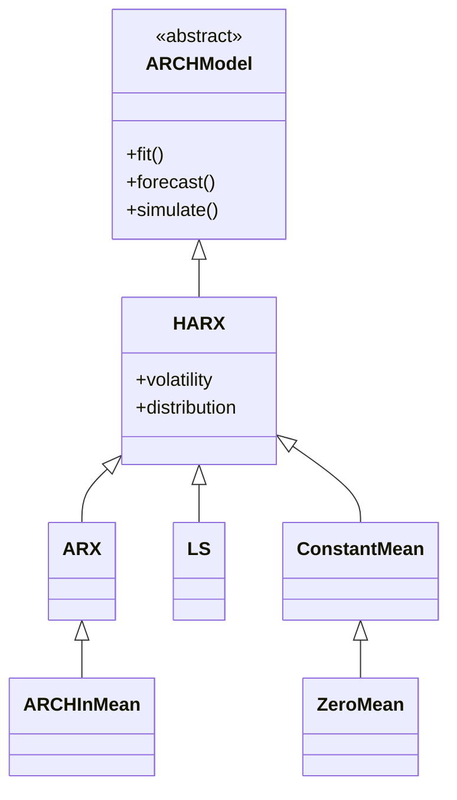

# arch_model 仓库完整分析报告

## 一、仓库概述

[arch](file://Users/mac/dev/personal/br_competition/OpenRepo/arch_model) 是一个专注于**金融计量经济学**的 Python 库，全称为 **Autoregressive Conditional Heteroskedasticity（自回归条件异方差）**。

> [!IMPORTANT]
> 这是一个成熟的、生产就绪的开源项目（Production/Stable），由 Kevin Sheppard (牛津大学) 维护，在业界和学术界广泛使用。

### 核心功能

1. **波动率建模** - GARCH 系列模型估计与预测
2. **单位根检验** - ADF、KPSS、Phillips-Perron 等检验
3. **协整分析** - Engle-Granger、Phillips-Ouliaris 检验及协整向量估计
4. **自助法（Bootstrap）** - 多种时间序列自助法实现
5. **多重比较检验** - MCS、SPA、StepM 等模型比较方法
6. **长期协方差估计** - Newey-West 等核函数估计器

---

## 二、核心模块详解

### 2.1 波动率建模模块 (`arch.univariate`)

这是仓库最核心的功能模块，位于 [arch/univariate/](file://Users/mac/dev/personal/br_competition/OpenRepo/arch_model/arch/univariate)。

#### 主入口函数：[arch_model()](file://Users/mac/dev/personal/br_competition/OpenRepo/arch_model/arch/univariate/mean.py#1887-2078)

文件位置：[arch/univariate/mean.py](file://Users/mac/dev/personal/br_competition/OpenRepo/arch_model/arch/univariate/mean.py#L1887-L2077)

```python
def arch_model(
    y: ArrayLike | None,
    x: ArrayLike | ArrayLike2D | None = None,
    mean: Literal["Constant", "Zero", "LS", "AR", "ARX", "HAR", "HARX"] = "Constant",
    lags: int | list[int] | None = 0,
    vol: Literal["GARCH", "ARCH", "EGARCH", "FIGARCH", "APARCH", "HARCH"] = "GARCH",
    p: int | list[int] = 1,
    o: int = 0,
    q: int = 1,
    power: float = 2.0,
    dist: Literal["normal", "gaussian", "t", "studentst", "skewstudent", "skewt", "ged"] = "normal",
    hold_back: int | None = None,
    rescale: bool | None = None,
) -> HARX:
```

**支持的均值模型** ([mean](file://Users/mac/dev/personal/br_competition/OpenRepo/arch_model/arch/univariate/mean.py#394-432) 参数)：
| 模型 | 说明 | 类 |
|------|------|-----|
| [Constant](file://Users/mac/dev/personal/br_competition/OpenRepo/arch_model/arch/univariate/mean.py#1092-1235) | 常数均值 | [ConstantMean](file://Users/mac/dev/personal/br_competition/OpenRepo/arch_model/arch/univariate/mean.py#1092-1235) |
| [Zero](file://Users/mac/dev/personal/br_competition/OpenRepo/arch_model/arch/univariate/mean.py#1237-1388) | 零均值 | [ZeroMean](file://Users/mac/dev/personal/br_competition/OpenRepo/arch_model/arch/univariate/mean.py#1237-1388) |
| [LS](file://Users/mac/dev/personal/br_competition/OpenRepo/arch_model/arch/univariate/mean.py#1520-1588) | 最小二乘 | [LS](file://Users/mac/dev/personal/br_competition/OpenRepo/arch_model/arch/univariate/mean.py#1520-1588) |
| [AR](file://Users/mac/dev/personal/br_competition/OpenRepo/arch_model/arch/univariate/mean.py#1390-1518) | 自回归 | [ARX](file://Users/mac/dev/personal/br_competition/OpenRepo/arch_model/arch/univariate/mean.py#1390-1518) |
| [ARX](file://Users/mac/dev/personal/br_competition/OpenRepo/arch_model/arch/univariate/mean.py#1390-1518) | 带外生变量的 AR | [ARX](file://Users/mac/dev/personal/br_competition/OpenRepo/arch_model/arch/univariate/mean.py#1390-1518) |
| [HAR](file://Users/mac/dev/personal/br_competition/OpenRepo/arch_model/arch/univariate/mean.py#155-1090) | 异质自回归 | [HARX](file://Users/mac/dev/personal/br_competition/OpenRepo/arch_model/arch/univariate/mean.py#155-1090) |
| [HARX](file:/ \_model/arch/univariate/mean.py#155-1090) | 带外生变量的 HAR | [HARX](file://Users/mac/dev/personal/br_competition/OpenRepo/arch_model/arch/univariate/mean.py#155-1090) |

**支持的波动率模型** ([vol](file://Users/mac/dev/personal/br_competition/OpenRepo/arch_model/arch/univariate/volatility.py#260-279) 参数)：
| 模型 | 说明 |
|------|------|
| `GARCH` | 广义自回归条件异方差（默认） |
| [ARCH](file://Users/mac/dev/personal/br_competition/OpenRepo/arch_model/arch/univariate/mean.py#1590-1885) | 自回归条件异方差 |
| `EGARCH` | 指数 GARCH |
| `FIGARCH` | 分数积分 GARCH |
| `APARCH` | 非对称幂 ARCH |
| `HARCH` | 异质 ARCH |

**支持的误差分布** (`dist` 参数)：

- `normal/gaussian` - 正态分布
- `t/studentst` - 学生 t 分布
- `skewstudent/skewt` - 偏斜学生 t 分布
- [ged](file://Users/mac/dev/personal/br_competition/OpenRepo/arch_model/arch/univariate/mean.py#315-323) - 广义误差分布

#### 模型类继承结构



---

### 2.2 单位根检验模块 (`arch.unitroot`)

位于 [arch/unitroot/unitroot.py](file://Users/mac/dev/personal/br_competition/OpenRepo/arch_model/arch/unitroot/unitroot.py)。

**核心检验类**：
| 检验 | 类名 | 用途 |
|------|------|------|
| Augmented Dickey-Fuller | `ADF` | 检验序列是否含有单位根 |
| Dickey-Fuller GLS | `DFGLS` | ADF 的 GLS 去趋势版本 |
| Phillips-Perron | `PhillipsPerron` | 非参数单位根检验 |
| KPSS | `KPSS` | 检验序列平稳性（原假设为平稳） |
| Zivot-Andrews | `ZivotAndrews` | 带结构突变的单位根检验 |
| Variance Ratio | `VarianceRatio` | 方差比检验 |

---

### 2.3 协整分析模块 (`arch.unitroot.cointegration`)

位于 [arch/unitroot/cointegration.py](file://Users/mac/dev/personal/br_competition/OpenRepo/arch_model/arch/unitroot/cointegration.py)。

**核心函数和类**：

```python
# 协整检验
from arch.unitroot.cointegration import engle_granger, phillips_ouliaris

# 协整向量估计
from arch.unitroot.cointegration import DynamicOLS
```

---

### 2.4 自助法模块 (`arch.bootstrap`)

位于 [arch/bootstrap/base.py](file://Users/mac/dev/personal/br_competition/OpenRepo/arch_model/arch/bootstrap/base.py)。

**自助法类型**：
| 类名 | 用途 |
|------|------|
| [IIDBootstrap](file:///Users/mac/dev/personal/easystat/OpenRepo/%E9%87%91%E8%9E%8D/arch_model/arch/bootstrap/base.py#313-1191) | IID 均匀重抽样自助法 |
| `StationaryBootstrap` | 平稳自助法（随机块长度） |
| `CircularBlockBootstrap` | 循环块自助法 |
| `MovingBlockBootstrap` | 移动块自助法 |

**辅助函数**：

- [optimal_block_length(x)](file:///Users/mac/dev/personal/easystat/OpenRepo/%E9%87%91%E8%9E%8D/arch_model/arch/bootstrap/base.py#126-203) - 估计最优块长度

---

### 2.5 多重比较模块 (`arch.bootstrap.multiple_comparison`)

位于 [arch/bootstrap/multiple_comparison.py](file://Users/mac/dev/personal/br_competition/OpenRepo/arch_model/arch/bootstrap/multiple_comparison.py)。

**核心类**：
| 类名 | 用途 |
|------|------|
| [MCS](file:///Users/mac/dev/personal/easystat/OpenRepo/%E9%87%91%E8%9E%8D/arch_model/arch/bootstrap/multiple_comparison.py#71-353) | Model Confidence Set（模型置信集） |
| `SPA` | Superior Predictive Ability（优越预测能力检验） |
| [StepM](file:///Users/mac/dev/personal/easystat/OpenRepo/%E9%87%91%E8%9E%8D/arch_model/arch/bootstrap/multiple_comparison.py#355-498) | StepM 多重比较程序 |
| `RealityCheck` | Reality Check 检验 |

---

### 2.6 长期协方差估计模块 (`arch.covariance`)

位于 [arch/covariance/kernel.py](file://Users/mac/dev/personal/br_competition/OpenRepo/arch_model/arch/covariance/kernel.py)。

**可用的核函数估计器**：

- `Bartlett` (即 Newey-West)
- `Parzen`
- `QuadraticSpectral`
- `TukeyHamming`, `TukeyHanning`, `TukeyParzen`
- `Andrews` (即 `QuadraticSpectral`)
- `Gallant`
- `NeweyWest` (即 `Bartlett`)

---

## 三、使用方法

### 3.1 安装

**PyPI 安装**：

```bash
pip install arch
```

**Conda 安装**：

```bash
conda install arch-py -c conda-forge
```

> [!NOTE]
> conda 上的包名是 `arch-py`，而非 [arch](file:///Users/mac/dev/personal/easystat/OpenRepo/%E9%87%91%E8%9E%8D/arch_model/arch/univariate/mean.py#1887-2078)。

**从源码安装**：

```bash
pip install git+https://github.com/bashtage/arch.git
```

### 3.2 基础使用示例

#### 波动率建模（GARCH）

```python
import datetime as dt
import pandas_datareader.data as web
from arch import arch_model

# 获取数据
data = web.get_data_yahoo('^FTSE', start='1990-01-01', end='2014-01-01')
returns = 100 * data['Adj Close'].pct_change().dropna()

# 构建并拟合 GARCH(1,1) 模型
am = arch_model(returns, vol='GARCH', p=1, q=1)
res = am.fit()
print(res.summary())

# 预测
forecasts = res.forecast(horizon=5)
print(forecasts.variance[-1:])
```

#### 单位根检验

```python
from arch.unitroot import ADF, KPSS

# ADF 检验
adf = ADF(returns, lags=5)
print(adf.summary())

# KPSS 检验
kpss = KPSS(returns)
print(kpss.summary())
```

#### 自助法置信区间

```python
import numpy as np
from arch.bootstrap import IIDBootstrap

# 定义统计量函数
def sharpe_ratio(x):
    mu, sigma = 12 * x.mean(), np.sqrt(12 * x.var())
    return np.array([mu, sigma, mu / sigma])

# 构建置信区间
bs = IIDBootstrap(returns)
ci = bs.conf_int(sharpe_ratio, 1000, method='percentile')
print(ci)
```

#### 长期协方差估计

```python
from arch.covariance.kernel import Bartlett
from arch.data import nasdaq

data = nasdaq.load()
returns = data[["Adj Close"]].pct_change().dropna()

cov_est = Bartlett(returns ** 2)
print(cov_est.cov.long_run)
```

---

## 四、入口函数一览表

| 功能           | 入口点                                                                                                                                                             | 位置                                                                                                                                            |
| -------------- | ------------------------------------------------------------------------------------------------------------------------------------------------------------------ | ----------------------------------------------------------------------------------------------------------------------------------------------- |
| **波动率建模** | `arch.arch_model()`                                                                                                                                                | [arch/**init**.py](file://Users/mac/dev/personal/br_competition/OpenRepo/arch_model/arch/__init__.py)                                           |
| **单位根检验** | `arch.unitroot.ADF`, `KPSS`, `PhillipsPerron` 等                                                                                                                   | [arch/unitroot/unitroot.py](file://Users/mac/dev/personal/br_competition/OpenRepo/arch_model/arch/unitroot/unitroot.py)                         |
| **协整检验**   | `arch.unitroot.cointegration.engle_granger`, `phillips_ouliaris`                                                                                                   | [arch/unitroot/cointegration.py](file://Users/mac/dev/personal/br_competition/OpenRepo/arch_model/arch/unitroot/cointegration.py)               |
| **自助法**     | `arch.bootstrap.IIDBootstrap`, `StationaryBootstrap` 等                                                                                                            | [arch/bootstrap/base.py](file://Users/mac/dev/personal/br_competition/OpenRepo/arch_model/arch/bootstrap/base.py)                               |
| **多重比较**   | `arch.bootstrap.MCS`, `SPA`, [StepM](file:///Users/mac/dev/personal/easystat/OpenRepo/%E9%87%91%E8%9E%8D/arch_model/arch/bootstrap/multiple_comparison.py#355-498) | [arch/bootstrap/multiple_comparison.py](file://Users/mac/dev/personal/br_competition/OpenRepo/arch_model/arch/bootstrap/multiple_comparison.py) |
| **协方差估计** | `arch.covariance.kernel.Bartlett` 等                                                                                                                               | [arch/covariance/kernel.py](file://Users/mac/dev/personal/br_competition/OpenRepo/arch_model/arch/covariance/kernel.py)                         |

---

## 五、部署与开发

### 5.1 系统依赖

来源：[pyproject.toml](file://Users/mac/dev/personal/br_competition/OpenRepo/arch_model/pyproject.toml#L10-L19)

**必须依赖**：

- Python ≥ 3.10
- NumPy ≥ 1.22.3
- Pandas ≥ 1.4.0
- SciPy ≥ 1.8
- statsmodels ≥ 0.13.0

**可选依赖**：

- `matplotlib` - 绑图
- `cython` - 性能优化
- `numba` - JIT 编译加速

### 5.2 开发环境设置

```bash
# 克隆仓库
git clone https://github.com/bashtage/arch.git
cd arch

# 安装开发依赖
pip install -e ".[dev]"

# 运行测试
pytest arch/tests

# 构建文档
pip install -e ".[doc]"
cd doc && make html
```

### 5.3 作为依赖使用

在项目的 [requirements.txt](file:///Users/mac/dev/personal/easystat/OpenRepo/%E9%87%91%E8%9E%8D/arch_model/requirements.txt) 或 [pyproject.toml](file:///Users/mac/dev/personal/easystat/OpenRepo/%E9%87%91%E8%9E%8D/arch_model/pyproject.toml) 中添加：

```
arch>=7.0
```

---

## 六、代码修改指南

### 6.1 添加新的波动率模型

1. **定义新模型类**：继承 [VolatilityProcess](file:///Users/mac/dev/personal/easystat/OpenRepo/%E9%87%91%E8%9E%8D/arch_model/arch/univariate/volatility.py#202-861) 基类
   - 位置：[arch/univariate/volatility.py](file://Users/mac/dev/personal/br_competition/OpenRepo/arch_model/arch/univariate/volatility.py#L202-L860)
2. **实现必须的抽象方法**：

   - `compute_variance()` - 计算条件方差递归
   - `backcast()` - 初始化回溯值
   - [starting_values()](file:///Users/mac/dev/personal/easystat/OpenRepo/%E9%87%91%E8%9E%8D/arch_model/arch/univariate/mean.py#1756-1758) - 参数初始值
   - [parameter_names()](file:///Users/mac/dev/personal/easystat/OpenRepo/%E9%87%91%E8%9E%8D/arch_model/arch/univariate/mean.py#329-331) - 参数名称
   - `bounds()` - 参数边界
   - `constraints()` - 参数约束

3. **在 [arch_model()](file:///Users/mac/dev/personal/easystat/OpenRepo/%E9%87%91%E8%9E%8D/arch_model/arch/univariate/mean.py#1887-2078) 中注册**：
   - 修改 [arch/univariate/mean.py](file://Users/mac/dev/personal/br_competition/OpenRepo/arch_model/arch/univariate/mean.py#L1993-L2064) 中的 `known_vol` 元组和条件分支

### 6.2 添加新的分布

1. **定义新分布类**：继承 `Distribution` 基类

   - 位置：[arch/univariate/distribution.py](file://Users/mac/dev/personal/br_competition/OpenRepo/arch_model/arch/univariate)

2. **在 [arch_model()](file:///Users/mac/dev/personal/easystat/OpenRepo/%E9%87%91%E8%9E%8D/arch_model/arch/univariate/mean.py#1887-2078) 中注册**：
   - 修改 `known_dist` 元组和条件分支

### 6.3 添加新的单位根检验

1. **继承 [UnitRootTest](file:///Users/mac/dev/personal/easystat/OpenRepo/%E9%87%91%E8%9E%8D/arch_model/arch/unitroot/unitroot.py#492-662) 基类**：

   - 位置：[arch/unitroot/unitroot.py](file://Users/mac/dev/personal/br_competition/OpenRepo/arch_model/arch/unitroot/unitroot.py#L492-L661)

2. **实现 [\_compute_statistic()](file:///Users/mac/dev/personal/easystat/OpenRepo/%E9%87%91%E8%9E%8D/arch_model/arch/unitroot/unitroot.py#537-542) 方法**

### 6.4 文件结构速览

```
arch/
├── __init__.py           # 主入口，导出 arch_model
├── univariate/           # 波动率建模
│   ├── mean.py          # 均值模型 + arch_model 函数
│   ├── volatility.py    # 波动率过程
│   └── distribution.py  # 误差分布
├── unitroot/            # 单位根与协整
│   ├── unitroot.py      # 单位根检验
│   └── cointegration.py # 协整分析
├── bootstrap/           # 自助法
│   ├── base.py          # Bootstrap 类
│   └── multiple_comparison.py  # 多重比较
├── covariance/          # 长期协方差
│   └── kernel.py        # 核函数估计器
├── data/                # 内置数据集
└── tests/               # 测试用例
```

---

## 七、示例 Notebooks

仓库提供了丰富的示例，位于 [examples/](file://Users/mac/dev/personal/br_competition/OpenRepo/arch_model/examples)：

| Notebook                                                                                                                                                                                               | 内容             |
| ------------------------------------------------------------------------------------------------------------------------------------------------------------------------------------------------------ | ---------------- |
| [univariate_volatility_modeling.ipynb](file:///Users/mac/dev/personal/easystat/OpenRepo/%E9%87%91%E8%9E%8D/arch_model/examples/univariate_volatility_modeling.ipynb)                                   | GARCH 建模基础   |
| [univariate_volatility_forecasting.ipynb](file:///Users/mac/dev/personal/easystat/OpenRepo/%E9%87%91%E8%9E%8D/arch_model/examples/univariate_volatility_forecasting.ipynb)                             | 波动率预测       |
| [univariate_using_fixed_variance.ipynb](file:///Users/mac/dev/personal/easystat/OpenRepo/%E9%87%91%E8%9E%8D/arch_model/examples/univariate_using_fixed_variance.ipynb)                                 | 固定方差模型     |
| [univariate_volatility_scenarios.ipynb](file:///Users/mac/dev/personal/easystat/OpenRepo/%E9%87%91%E8%9E%8D/arch_model/examples/univariate_volatility_scenarios.ipynb)                                 | 情景分析         |
| [univariate_forecasting_with_exogenous_variables.ipynb](file:///Users/mac/dev/personal/easystat/OpenRepo/%E9%87%91%E8%9E%8D/arch_model/examples/univariate_forecasting_with_exogenous_variables.ipynb) | 带外生变量的预测 |
| [unitroot_examples.ipynb](file:///Users/mac/dev/personal/easystat/OpenRepo/%E9%87%91%E8%9E%8D/arch_model/examples/unitroot_examples.ipynb)                                                             | 单位根检验示例   |
| [unitroot_cointegration_examples.ipynb](file:///Users/mac/dev/personal/easystat/OpenRepo/%E9%87%91%E8%9E%8D/arch_model/examples/unitroot_cointegration_examples.ipynb)                                 | 协整分析示例     |
| [bootstrap_examples.ipynb](file:///Users/mac/dev/personal/easystat/OpenRepo/%E9%87%91%E8%9E%8D/arch_model/examples/bootstrap_examples.ipynb)                                                           | 自助法示例       |
| [multiple-comparison_examples.ipynb](file:///Users/mac/dev/personal/easystat/OpenRepo/%E9%87%91%E8%9E%8D/arch_model/examples/multiple-comparison_examples.ipynb)                                       | 多重比较示例     |

---

## 八、总结

| 项目           | 说明                                               |
| -------------- | -------------------------------------------------- |
| **仓库定位**   | 金融计量经济学专业 Python 库                       |
| **核心入口**   | `from arch import arch_model`                      |
| **主要功能**   | 波动率建模、单位根检验、协整分析、自助法、多重比较 |
| **适用场景**   | 金融时间序列分析、风险管理、学术研究               |
| **修改切入点** | `arch/univariate/` 目录下的模型类                  |
