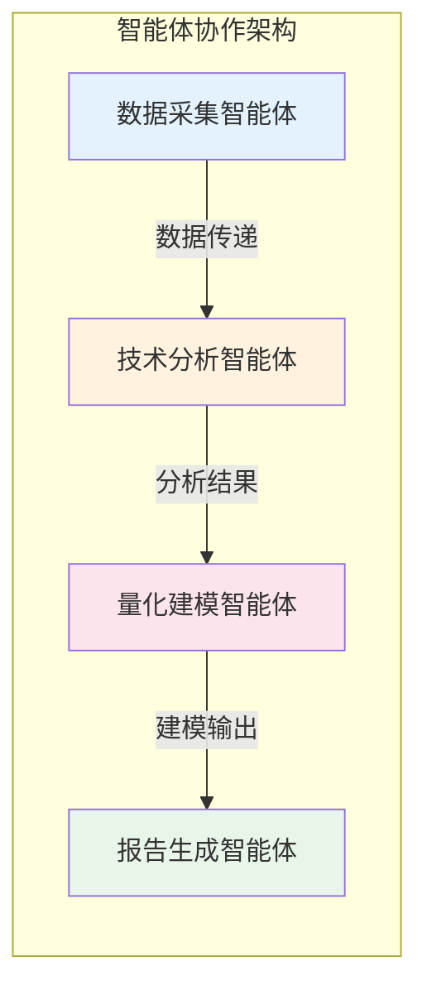
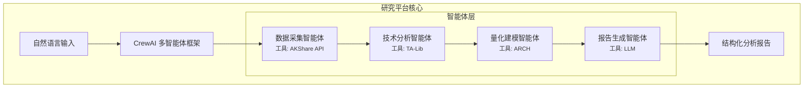
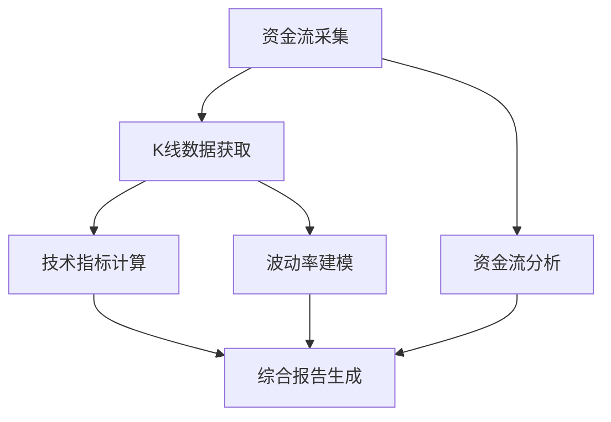

# EasySTAT：基于多智能体协作的金融分析研究平台

> 面向金融科技与人工智能交叉领域的研究工具

---

## 一、研究背景

随着大语言模型（LLM）技术的发展，**多智能体系统（Multi-Agent System, MAS）** 在复杂任务处理中展现出显著优势。EasySTAT 是一个将多智能体协作机制应用于金融分析领域的研究平台，旨在探索 AI 智能体在专业领域任务中的分工协作模式。

---

## 二、研究价值与创新点

### 2.1 多智能体协作范式



**研究意义**：
- 探索专业领域中智能体的**角色分化与任务分配**机制
- 验证多智能体顺序协作在复杂金融分析任务中的有效性
- 为 LLM-based Agent 的工具调用能力提供实证研究案例

---

### 2.2 可探索的研究方向

| 研究方向 | 具体问题 | 本平台支持 |
|----------|----------|------------|
| **多智能体系统** | 智能体间的信息传递与协作效率 | ✅ 4 智能体顺序协作流程 |
| **金融 NLP** | 自然语言到金融查询的语义理解 | ✅ 用户意图解析与任务映射 |
| **量化金融** | GARCH 波动率建模与风险评估 | ✅ 内置 ArchTool |
| **技术分析自动化** | 技术指标的智能计算与解读 | ✅ RSI/MACD/布林带等 |
| **知识融合** | 多源数据整合与报告生成 | ✅ 结构化报告输出 |

---

## 三、系统架构



---

## 四、技术创新点

### 4.1 智能体角色设计

每个智能体具有独立的：
- **Role（角色定义）**：明确的专业身份
- **Goal（目标设定）**：具体的任务目标
- **Backstory（背景设定）**：专业知识背景
- **Tools（工具配备）**：专属的能力工具

### 4.2 任务编排机制



- **任务依赖管理**：通过 `context` 字段定义任务间依赖
- **顺序执行流程**：基于 CrewAI 的 Sequential Process
- **容错处理**：数据缺失时的优雅降级

---

## 五、研究应用场景

### 场景 1：多智能体协作效率研究
- 对比单智能体与多智能体在复杂任务上的表现
- 分析智能体数量与任务完成质量的关系

### 场景 2：金融领域 LLM 能力评估
- 评估 LLM 在金融术语理解和专业分析中的准确性
- 研究 prompt 设计对金融推理的影响

### 场景 3：人机协作模式探索
- 研究自然语言交互在专业领域的可用性
- 探索用户需求表达与系统响应的匹配程度

### 场景 4：量化分析自动化
- 技术指标计算的自动化流程
- GARCH 风险建模的实践应用

---

## 六、数据与方法

| 组件 | 数据来源/方法 | 用途 |
|------|---------------|------|
| 股票行情 | AKShare（A股数据接口） | 历史价格、成交量 |
| 资金流向 | 东方财富 | 主力/散户资金动向 |
| 宏观数据 | AKShare | GDP、CPI、PMI 等 |
| 技术分析 | ta 库 | RSI、MACD、布林带、ATR |
| 波动率建模 | arch 库 | GARCH(1,1) 模型 |

---

## 七、项目结构

```
EasySTAT/
├── src/financial_crew/
│   ├── crew.py          # 多智能体定义
│   ├── config/
│   │   ├── agents.yaml  # 智能体配置
│   │   └── tasks.yaml   # 任务配置
│   └── tools/           # 工具集
│       ├── crawler_tool.py    # 资金流采集
│       ├── ohlcv_tool.py      # K线数据
│       ├── ta_tool.py         # 技术分析
│       └── arch_tool.py       # 波动率建模
└── tests/               # 实验脚本
```

---

## 八、总结

EasySTAT 为以下研究提供了实验平台：

1. **多智能体协作**：专业领域中的智能体分工与协作
2. **金融 NLP**：自然语言与金融任务的语义桥接
3. **量化风控**：自动化技术分析与风险评估
4. **人机交互**：专业领域的自然语言交互设计

---

**项目定位**：学术研究与教学实验平台  
**核心框架**：CrewAI（多智能体编排）  
**研究领域**：金融科技 × 人工智能
